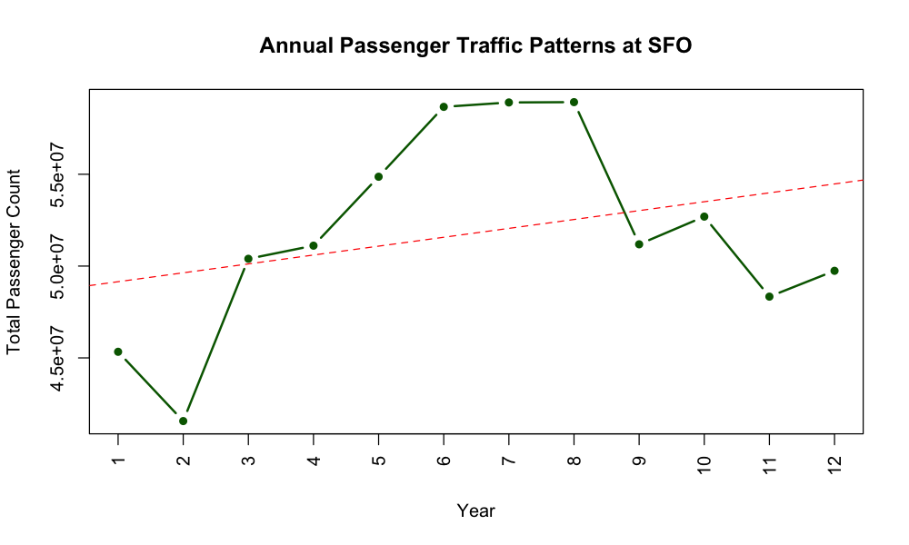

# OVERVIEW
This project is about analyzing the Air traffic dataset from 2006 to 2019.

# INTRODUCTION:
This report is based on the Airport data set, a record of monthly passenger activity at SFO from July 2005 to June 2019. I was to examine the most popular airline, the best time for departure and the best time to travel.  I was particularly interested in trips between Australia and San Francisco. This study will explain which time is the most appropriate, mainly by the number of passengers. The dataset includes all flights that arrived at SFO as well those that departed from SFO. 

# OBSERVATIONS:
1.	The Data is partial in 2005 as it starts from July and again partial in 2019, till June. 
2.	No connecting airport information is available. 
3.	United airlines has two entries, one for before 2013 – likely prior to a merger with another airline.
4.	The passengers generally decreased until around 2009 and increased from then on to a higher number. There was possibly a link between the passenger trend and the ongoing economic downturn in 2008/2009.

# ANALYSIS:

# CONCLUSION
1.	The measurements explained that most of the flights are domestic.
a.	From information of the flights between Australia and SFO, international flights must have become less popular in the late 2000s.  
2.	With the information limited to passengers, the year with most flights turns out to be recent.
a.	Though there were more and more passengers more after that, there is not enough proof that the next year will be the best to fly.
b.	But from the data alone, it can be concluded that 2018 or 2019 would be the best year to take a flight,
3.	This report proves what is believed to be the most appropriate time to take a flight.
a.	From the evidence of one region (Australia), I have compared the airlines by its popularity. I have answered the question of choosing “the best” or appropriate airline to go to Australia. 
b.	To answer the question of the most appropriate airline in general, I need to examine the airlines managing general flights to and from SFO.
