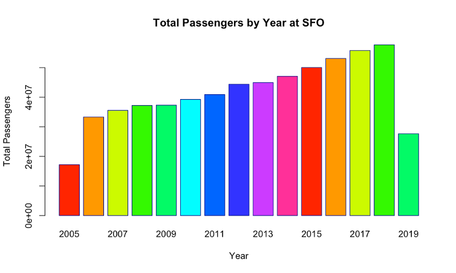

# OVERVIEW
This project is about analyzing the Air traffic dataset from 2006 to 2019.

# INTRODUCTION:
This report is based on the Airport data set, a record of monthly passenger activity at SFO from July 2005 to June 2019. I was to examine the most popular airline, the best time for departure and the best time to travel.  I was particularly interested in trips between Australia and San Francisco. This study will explain which time is the most appropriate, mainly by the number of passengers. The dataset includes all flights that arrived at SFO as well those that departed from SFO. 

# OBSERVATIONS:
1.	The Data is partial in 2005 as it starts from July and again partial in 2019, till June. 
2.	No connecting airport information is available. 
3.	United airlines has two entries, one for before 2013 – likely prior to a merger with another airline.
4.	The passengers generally decreased until around 2009 and increased from then on to a higher number. There was possibly a link between the passenger trend and the ongoing economic downturn in 2008/2009.

# ANALYSIS:
# Traffic Growth
The passenger traffic has been steadily increasing over the years, except for 2008-2009 where the growth stalled likely from Economic conditions.  See the chart below for the trend.

# Seasonality 
As anticipated, there is an increase in demand during the Summer. In the US, traffic peaks in July and February has been the lowest monthly traffic. February consistently sees the lowest traffic, partly due to being a shorter month. 

While, the traffic is seasonal, comparing international vs domestic traffic shows a different picture. International traffic stays almost flat throughout the year. 

# Comparison of International and Domestic

Domestic traffic pattern looks a lot similar to that of overall traffic. It is because of the majority of the flights being domestic. 

The total international passengers decrease per month until 2009 and then increases again. There was a dip in international passenger traffic and it has been growing steadily since 2011.

# International Deep Dive - Australia

Australia has had less passengers from 2006 to 2016. The total passengers roughly decreases until 2010 and increases from then on, up to more than the beginning.

The sum of passengers in Australia decreases roughly up to May, and then increases to an intermediate number in July. The total monthly passengers stay low until November and increase by December.

The data for United Airlines was split into statistics until and after 2013 respectively, so I tested data for after 2013. What is now United Airlines is the most popular, followed by Air New Zealand. After Qantas Airways, there are very little passengers that travel here. 

# Best Month to Travel to Australia
January:	716,866
December:	684,652
July:	604,845
